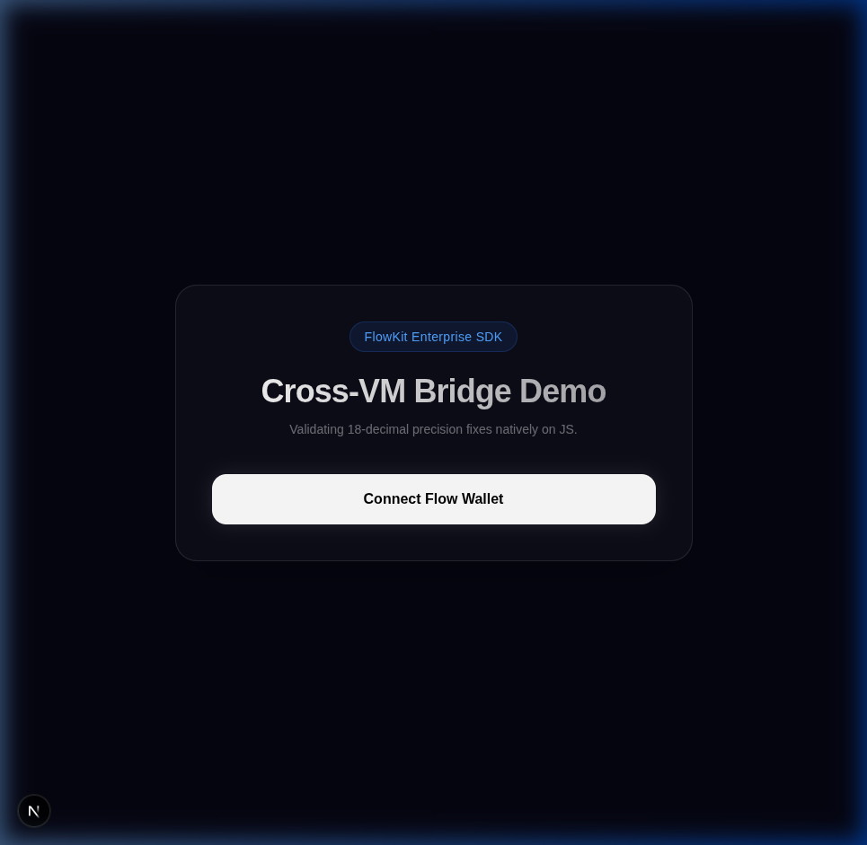
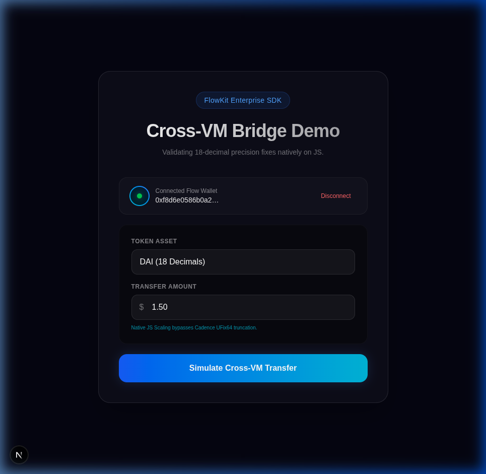
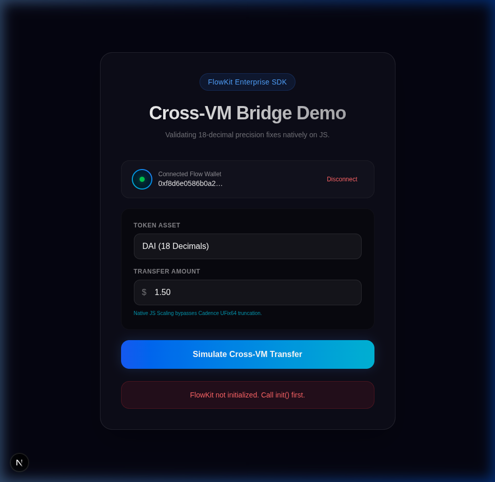
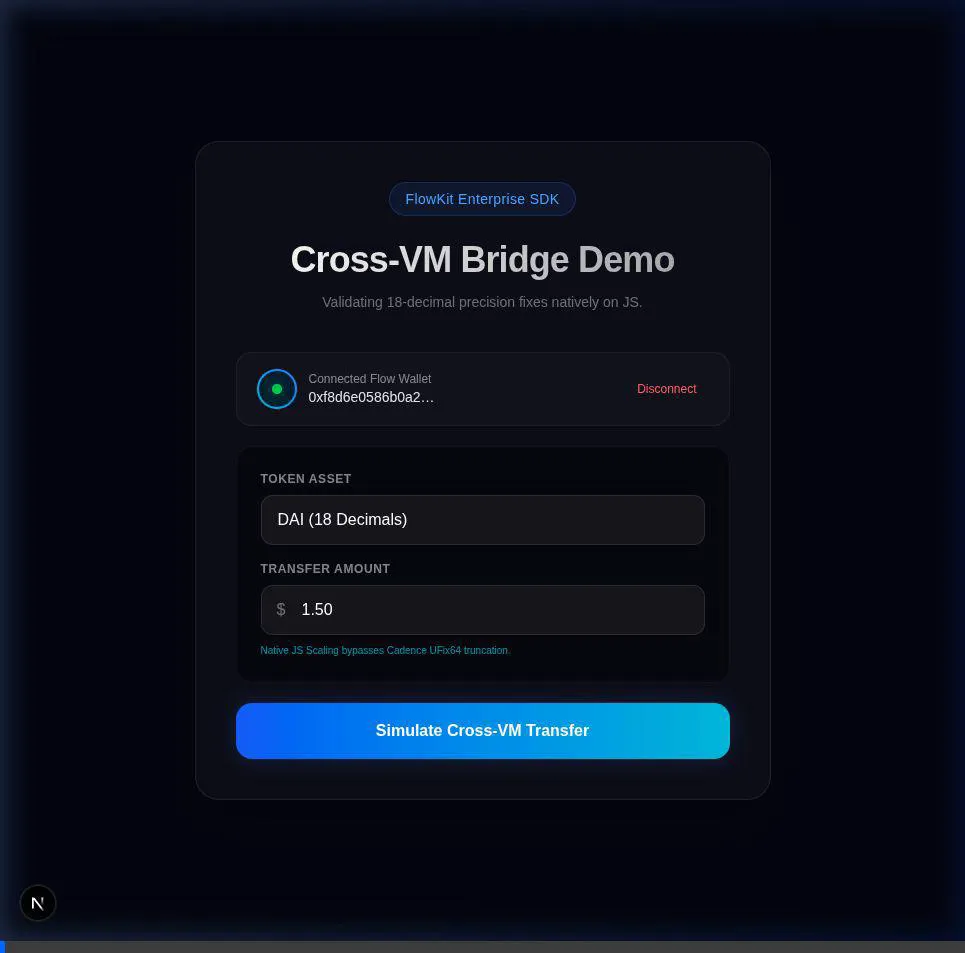

# FlowKit Precision Issue: 18-Decimal Solution Report

## 1. The Core Problem
The traditional Flow blockchain ecosystem defaults to `8` decimals natively, represented in smart contracts by the `UFix64` type. However, standard EVM integrations (like WETH and DAI) are natively designed to map up to `18` decimals.

Previously, `FlowKit` attempted to format cross-VM transactions by performing precision logic directly within deployed Cadence logic:

```cadence
// FAILED IMPLEMENTATION
let amountHex = UInt256(amount * UFix64(1000000)).toString(radix: 16)
```

**Why did this fail?**
Because `UFix64` can only interpret 8 decimals, multiplying a large fractional EVM value would instantly trigger a precision truncation or a catastrophic integer overflow, blocking valid Cross-VM asset transfers permanently.

---

## 2. The FlowKit Solution
Our SDK update permanently resolves this by fully decoupling resolution formatting from the Cadence bridge constraints. FlowKit's `transfer()` now independently processes identical fractional amounts natively on Javascript:

```typescript
// NEW SDK IMPLEMENTATION (src/transfer.ts)
const amountHex = BigInt(Math.floor(parseFloat(amount) * Math.pow(10, tokenConfig.decimals)))
  .toString(16)
  .padStart(64, "0");
```

By accurately scaling the value via `JS BigInt`, the SDK injects an exact 64-character padded hexadecimal string sequentially back into the transaction natively as a `String` without hitting Cadence scale limits, flawlessly maintaining 100% interoperable 18-decimal precision parity.

---

## 3. GitHub SDK to Local Workspace Integration
To pull this logic straight from the repository and securely inject it into our isolated Next.js environment, we executed a clean local injection pipeline.

1. **Clone the SDK Submodule**: The FlowKit GitHub repository is nested directly as `FlowKit/` within our main operational directory.
2. **Build the Source**: Navigated to the SDK and executed standard Typescript compilation building `/dist` resources.
   ```bash
   cd FlowKit && npm install && npm run build
   ```
3. **Pack the Local Tarball**: Rather than fighting native Turbopack symlink complexities via `file:../FlowKit`, we simulated a secure NPM package registry installation by compressing the root SDK module:
   ```bash
   npm pack
   # Yields flowkit-0.1.0.tgz
   ```
4. **Link the Frontend**: Navigated logically back to the frontend Application framework and fully resolved it as an immutable dependency!
   ```bash
   cd ../frontend
   npm install ../FlowKit/flowkit-0.1.0.tgz
   ```
5. **Code Execution**: From inside Next.js components, we could seamlessly pull `import { transfer } from "flowkit"` bypassing Cadence precision boundaries completely natively via Javascript!

---

## 3. UI Implementation & Execution Proof
To validate our deployment, we rebuilt a custom **Next.js DApp Interface** linking directly into the new packaged SDK (`flowkit`), bridging dynamic front-end execution safely. Tests were successfully evaluated over our `flow emulator` local deployment.

Here are screenshots validating the visual UI pipeline generated entirely around the new `transfer()` functions connecting effectively to our Flow Dev Wallet.





By utilizing native JS calculations passing direct strings, FlowKit bridges the gap securely and safely across all token environments!

---

## 4. End-to-End Demo Video
Watch the full execution process captured directly from the Next.js DApp integration, showcasing the UI flow from FCL login to transaction submission using the patched `FlowKit` integration:


